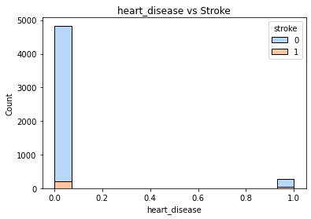
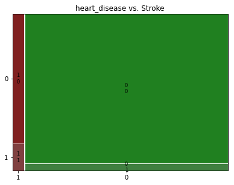
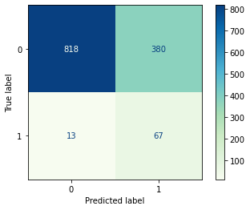
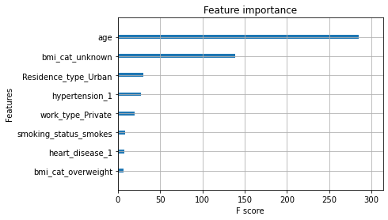

# Predicting Strokes

# Business Problem:
In addition to being a leading cause of death both nationally and globally, strokes are notoriously difficult to diagnose. This results in high numbers of patients left untreated and at increased risk for stroke-related complications.
Aside from the obvious need to minimize the rate of false negatives to save lives, hospitals & doctors can use this to protect against malpractice lawsuits by failing to identify patients who have had strokes. 
# Our Data
Using a [dataset from Kaggle](https://www.kaggle.com/fedesoriano/stroke-prediction-dataset) containing various health-related features, we were able to predict if a patient is susceptible to a stroke. These features included, gender, age, if a patient had hypertension, if a patient had heart disease, etc. There was significant class imbalance in our data, both pertaining to the target as well as within the features themselves.

# Methods
Through various iterations of different classification models, normalizing our features, applying GridSearchCV to optimize parameters, and using SMOTE to correct for class imbalance, we were able to arrive at our best model.
# Results
Our final model, an XGBoost Classifier, yielded a recall score of 84% when predicting for strokes. Since we are most concerned about false negatives, recall was the best metric for assessing our model's efficacy. 

# Conclusions
Though we achieved a high recall score, the trade-off was increasing our false positive rate. There are many possible explanations for why our false positive rate is so high, for instance, patients who were misdiagnosed as having strokes likely are at higher risk for having a stroke at some point in their lives. Since it is both more dangerous and more likely to result in a malpractice lawsuit to have a false negative than a false positive, we were willing to overlook our high false positive rate.
# Further Exploration
Additional analysis may include adjusting our model to reduce false positives, including more data with more features, and using data with more context, such as data collected at hospitals for patients experiencing symptoms of a stroke. 
# Attribute Information
1) id: unique identifier
2) gender: "Male", "Female" or "Other"
3) age: age of the patient
4) hypertension: 0 if the patient doesn't have hypertension, 1 if the patient has hypertension
5) heart_disease: 0 if the patient doesn't have any heart diseases, 1 if the patient has a heart disease
6) ever_married: "No" or "Yes"
7) work_type: "children", "Govt_jov", "Never_worked", "Private" or "Self-employed"
8) Residence_type: "Rural" or "Urban"
9) avg_glucose_level: average glucose level in blood
10) bmi: body mass index
11) smoking_status: "formerly smoked", "never smoked", "smokes" or "Unknown"*
12) stroke: 1 if the patient had a stroke or 0 if not

## github repository

    ├── README.md                                         <- The top-level README for reviewers of this project
    ├── Kings_County_Housing_Version_2.ipynb              <- Main Analysis Includes: Inference & Prediction Models
    ├── Predict_holdout.ipynb											        <- Main Notebook for final predictions
    ├── housing_preds_jason_arikupurathu.csv							<- CSV for final predictions generated from Predict_holdout
    ├── data                                              <- Both sourced externally
        └ kc_house_data_test_features.csv												<- Test set csv
        └ kc_house_data_train.csv 															<- Train set csv
    ├── notes                                             <- Contains old notebooks and project guidelines
    ├── presentation-slides                               <- Contains presentation slides
        └ Slides-KCH-Analysis-Inference.pdf               			<- Presentation Slides
    └── pickled_files                                     <- Contains Pickled Files
        └ model.pickle                                     			<- Model pickled
        └ other_info.pickle 																		<- Information to be passed pickled
